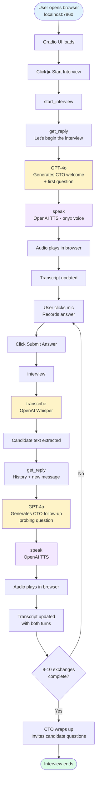

# Interview Bot — Application Flow

## Colour Legend

| Colour | Component |
|--------|-----------|
| Blue   | User action |
| Yellow | OpenAI — GPT-4o / Whisper |
| Purple | OpenAI TTS (voice output) |
| Green  | End state |

## Tech Stack

| Component | Technology |
|-----------|------------|
| UI | Gradio 6.x |
| Speech-to-Text | OpenAI Whisper (`whisper-1`) |
| Language Model | OpenAI GPT-4o |
| Text-to-Speech | OpenAI TTS (`tts-1`, voice: `onyx`) |
| Runtime | Python 3.13 |
